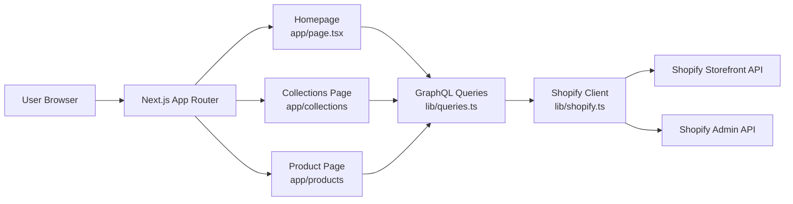
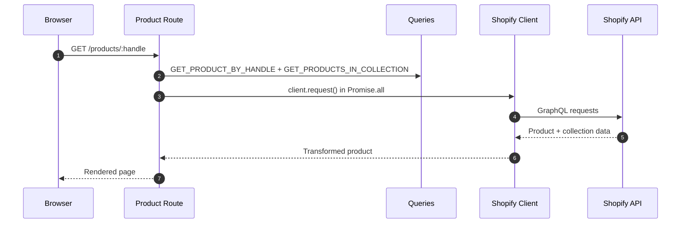

#  Enermation Website

**Next.js 16** — Storefront and marketing site for Enermation, with Shopify Storefront API integration, collection browsing, and product detail pages.

## At a glance

| Area | What it does | Key files |
|------|-------------|-----------|
| `web/` | Main Next.js application (App Router, React 19, Biome) | `web/package.json` |
| `web/lib/shopify.ts` | Dual Shopify client — Storefront API + Admin API for metafields | `web/lib/shopify.ts` |
| `web/lib/queries.ts` | GraphQL query/mutation string constants | `web/lib/queries.ts` |
| `web/app/page.tsx` | Homepage — sections + collection fetch | `web/app/page.tsx` |
| `web/app/collections/[handle]/page.tsx` | Collection pages with server-side sorting/filtering | `web/app/collections/[handle]/page.tsx` |
| `web/app/products/[handle]/page.tsx` | Product detail page + metadata + similar cars | `web/app/products/[handle]/page.tsx` |

## Architecture

### Shopify dual-client setup

| Client | Used for | Env |
|--------|----------|-----|
| `getClient()` — Storefront API (`@shopify/storefront-api-client`) | Products, collections, cart, blog | `PRIVATE_STOREFRONT_API_TOKEN` |
| `adminGraphQL()` — raw Admin REST/GraphQL | Metafields, metaobject resolution | `SHOPIFY_ADMIN_ACCESS_TOKEN` |

The Storefront API lacks `unauthenticated_read_metafields` in the Headless channel, so metafields are fetched server-side via the Admin API.

### Data layer

```
lib/queries.ts      — GraphQL query/mutation string constants (Storefront + Admin)
lib/shopify.ts      — Fetching logic, dual-client orchestration, caching, data transformation
lib/types.ts        — TypeScript interfaces for all Shopify response shapes
lib/cart-context.tsx — Client-side cart state with error handling
```

### Caching

All data-fetching functions in `shopify.ts` use Next.js `'use cache'` with `cacheLife` and `cacheTag` for persistent cross-request caching. Errors are thrown, not returned as `null` or `[]` — callers use `.catch(() => null)` for graceful degradation.

### Request flow





## Getting started

1. Install dependencies (from `web/` directory):

   ```bash
   bun install
   ```

2. Create `web/.env.local`:

   ```bash
   PUBLIC_STORE_DOMAIN=your-store.myshopify.com
   PRIVATE_STOREFRONT_API_TOKEN=your-storefront-token
   SHOPIFY_ADMIN_ACCESS_TOKEN=your-admin-token
   ```

3. Run dev server:

   ```bash
   bun run dev
   ```

4. Open `http://localhost:3000`

## Developer scripts

| Command | Purpose |
|---------|---------|
| `bun run dev` | Start local dev server |
| `bun run build` | Production build |
| `bun run start` | Run production server |
| `bun run lint` | Biome lint checks |
| `bun run format` | Biome formatting |

## Repository layout

| Path | Purpose |
|------|---------|
| `web/` | Main Next.js application (App Router, React 19) |
| `graphql/` | Shopify Storefront API query examples and Insomnia collection generator |
| `tasks/` | Working notes, lessons, and ad-hoc plans |

## API test route

Use `GET /api/test` to quickly validate Shopify query wiring:

- `/api/test?q=shop`
- `/api/test?q=products`
- `/api/test?q=product&handle=<product-handle>`
- `/api/test?q=collections`
- `/api/test?q=collection&handle=<collection-handle>`
- `/api/test?q=cart&cartId=<cart-id>`

Source: `web/app/api/test/route.ts`
