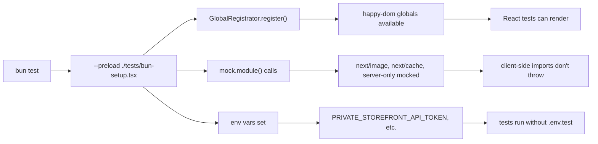
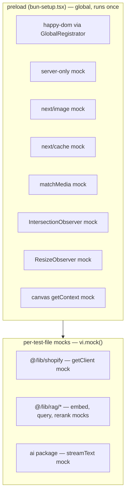

# Enermation Website

Next.js 16 application with Shopify Storefront API integration. Displays vehicle inventory, collection browsing, and product detail pages backed by Shopify data.

## Architecture

### Shopify dual-client setup

| Client | Used for | Env |
|--------|----------|-----|
| `getClient()` — Storefront API (`@shopify/storefront-api-client`) | Products, collections, cart, blog | `PRIVATE_STOREFRONT_API_TOKEN` |
| `adminGraphQL()` — raw Admin REST/GraphQL | Metafields, metaobject resolution | `SHOPIFY_ADMIN_ACCESS_TOKEN` |

The Storefront API doesn't expose `unauthenticated_read_metafields` in the Headless channel, so metafields are fetched server-side via the Admin API.

### Data layer

```
lib/queries.ts     — GraphQL query/mutation string constants (Storefront + Admin)
lib/shopify.ts     — Fetching logic, dual-client orchestration, caching, data transformation
lib/types.ts       — TypeScript interfaces for all Shopify response shapes
lib/cart-context.tsx — Client-side cart state (add, update, remove, error handling)
```

### Caching

All data-fetching functions in `shopify.ts` use Next.js `'use cache'` with `cacheLife` and `cacheTag` for persistent cross-request caching. Errors are thrown, not returned as `null` or `[]` — callers use `.catch(() => null)` for graceful degradation.

## Key files

| File | Role |
|------|------|
| `lib/shopify.ts` | `getClient()`, `adminGraphQL()`, product/collection/metafield fetchers |
| `lib/queries.ts` | Named GraphQL query constants (imported by shopify.ts) |
| `lib/types.ts` | `ShopifyProduct`, `ShopifyCart`, `ShopifyCollection`, `CartMutationResponse`, etc. |
| `app/actions/cart.ts` | Server actions for cart mutations |
| `lib/cart-context.tsx` | `CartProvider` + `useCart()` hook with error state |
| `lib/wishlist-context.tsx` | `WishlistProvider` + `useWishlist()` hook |

## Getting started

1. Install dependencies (from `web/` directory):

   ```bash
   bun install
   ```

2. Create `web/.env.local`:

   ```bash
   PUBLIC_STORE_DOMAIN=your-store.myshopify.com
   PRIVATE_STOREFRONT_API_TOKEN=your-storefront-token
   SHOPIFY_ADMIN_ACCESS_TOKEN=your-admin-token
   ```

3. Run dev server:

   ```bash
   bun run dev
   ```

4. Open `http://localhost:3000`

## Developer scripts

| Command | Purpose |
|---------|---------|
| `bun run dev` | Start local dev server |
| `bun run build` | Production build |
| `bun run start` | Run production server |
| `bun run lint` | Biome lint checks |
| `bun run format` | Biome formatting |

## Testing

Tests run with Bun (`bun test`) using happy-dom for DOM environment. No Vitest or jsdom.

### Commands

| Command | Purpose |
|---------|---------|
| `bun run test` | Unit + integration tests |
| `bun run test:unit` | Unit tests only |
| `bun run test:integration` | Integration tests only |
| `bun run test:e2e` | Playwright E2E tests |

### Test files

| File | Purpose |
|------|---------|
| `tests/bun-setup.tsx` | Preload: happy-dom, mocks (next/image, next/cache, server-only, matchMedia, IntersectionObserver, ResizeObserver, canvas), test env vars |
| `tests/test-utils.ts` | `mocked()` helper — replaces `vi.mocked()` for type assertions |

### Mock patterns

```ts
// vi.mocked() replacement — Bun has no equivalent:
vi.mocked(fn)  // Error
(fn as ReturnType<typeof vi.fn>).mockResolvedValue(value)  // OK

// Fake timers — same API as Vitest:
vi.useFakeTimers()
vi.runAllTimers()
vi.useRealTimers()
```

Full reference: `docs/BUN_TESTS.md`

### Test execution flow



### Mock layers



## Repository layout

```
web/           — Next.js application (App Router, React 19)
graphql/       — Shopify Storefront API query examples and Insomnia collection generator
tasks/         — Working notes, lessons, and ad-hoc plans
```